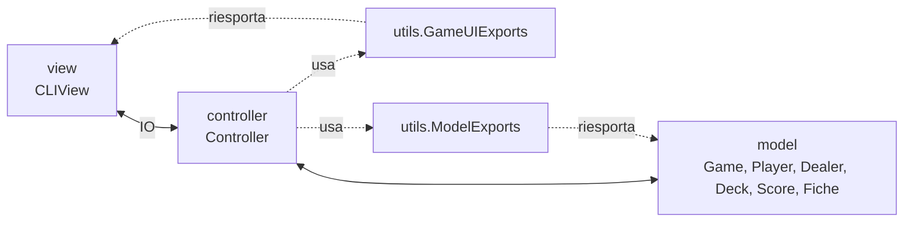

# Design architetturale

## Stile architetturale

Il progetto adotta il pattern **Model-View-Controller (MVC)**, riflesso direttamente nella struttura dei
package sorgente:

```
src/main/scala/
├── model/        # Regole di dominio del Black Jack
├── view/         # Interazione con l'utente da riga di comando
├── controller/    # Orchestrazione del ciclo di gioco
└── utils/        # Moduli di supporto e facciate tra i livelli
```



- Il **model** contiene esclusivamente logica di dominio pura o con effetti locali incapsulati (nessuna
  dipendenza da `view` o `controller`).
- La **view** (`CLIView`) si occupa solo della formattazione dei messaggi e della lettura degli input da
  console, senza contenere regole di gioco.
- Il **controller** (`Controller`, un `IOApp.Simple` di Cats Effect) orchestra il flusso: inizializza la
  partita, esegue il ciclo delle mani finché la partita non termina, gestendo la sequenza di operazioni
  tra `view` e `model`.

## Decisioni architetturali principali

### Facciate tra i livelli (`utils`)

`ModelExports` e `GameUIExports` sono due *facciate* che ri-esportano selettivamente i simboli pubblici
rispettivamente del `model` e della `view` (più le dipendenze esterne usate, come Cats Effect). Controller
e test dipendono da queste facciate anziché dai singoli package interni: questo disaccoppia i moduli e
permette di riorganizzare la struttura interna di `model`/`view` senza impattare chi li consuma.

### Gestione degli effetti con Cats Effect

Tutte le operazioni di I/O (lettura da tastiera, stampa a video) sono modellate come valori `IO[A]` di
Cats Effect e composte tramite *for-comprehension*. Questo rende esplicita, a livello di tipi, la
distinzione tra logica pura del `model` (funzioni totali, senza effetti) e orchestrazione con effetti
del `controller`, e consente di testare quest'ultimo tramite un `Console[IO]` di test (mock).

### Motore delle regole con tuProlog

Il calcolo del punteggio di una mano — comprese le regole sul valore dell'Asso e sul riconoscimento del
Blackjack — è delegato a un motore **Prolog** embedded (**tuProlog**), incapsulato da un adattatore
Scala (`Scala2P`) che espone le query Prolog come funzioni `Term => LazyList[Term]`. Questa scelta
isola le regole di punteggio, espresse dichiarativamente come fatti/clausole logiche, dal resto del
codice imperativo/funzionale Scala.

### Modulo come unità di incapsulamento (`XyzModule` pattern)

Ogni concetto di dominio (`GameModule`, `DealerModule`, `PlayerModule`, `DeckModule`, `FicheModule`,
`ScoreModule`, `ParticipantModule`) è organizzato come un `object` contenente: un `trait` che ne definisce
l'interfaccia pubblica, un'implementazione privata (quando necessaria) e un companion object con factory
e costanti. Questo pattern (variante del *cake pattern*) permette di programmare verso le interfacce
(`trait`) e di sostituire le implementazioni nei test tramite mock (Mockito) senza esporre lo stato interno.

## Pattern di progettazione impiegati

| Pattern | Dove | Motivazione |
|:--------|:-----|:-------------|
| Facade | `ModelExports`, `GameUIExports` | Disaccoppiare i package consumer dalla struttura interna di model/view |
| Adapter | `Scala2P` | Esporre l'API Java di tuProlog con un'interfaccia funzionale idiomatica Scala |
| Module / trait + companion factory | tutti i moduli `model` | Programmazione verso interfacce, testabilità, incapsulamento dello stato |
| State | `PlayerState` (Active/Standing/Busted/Blackjack) | Modellare esplicitamente le fasi del turno di un giocatore |
| Opaque type | `Deck` | Nascondere la rappresentazione (`List[Card]`) esponendo solo le operazioni di dominio |
