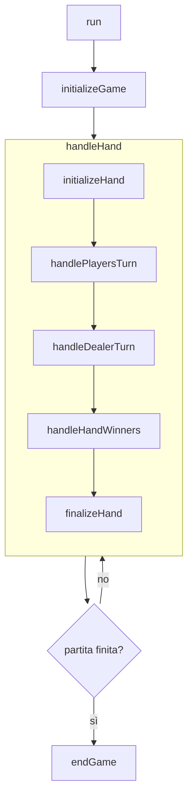

---

title: Controller
nav_order: 3
parent: Design di dettaglio
grand_parent: Report

---

# Design del Controller

Il *controller* (`object Controller extends IOApp.Simple`) è il punto d'ingresso dell'applicazione e l'orchestratore del
flusso di gioco. La sua struttura riflette direttamente le fasi di una partita: il metodo `run` inizializza la partita,
itera le mani finché la condizione di terminazione non è soddisfatta e gestisce la conclusione.

Il metodo `handleHand` racchiude le cinque fasi centrali di una mano, eseguite in sequenza; al termine il controllo
torna alla verifica della condizione di terminazione.

## Orchestrazione delle fasi

Ogni mano è scomposta in una sequenza di fasi, ciascuna realizzata da un metodo dedicato:

- `initializeHand` — raccoglie le puntate, distribuisce le carte iniziali, rileva i Blackjack e, se il banco mostra un
  Asso, gestisce l'assicurazione;
- `handlePlayersTurn` — itera i giocatori, gestendo il turno di ognuno (saltando chi ha già Blackjack);
- `handleDealerTurn` — scopre la carta del banco, risolve le assicurazioni e gioca il turno automatico del banco;
- `handleHandWinners` — determina le vincite, aggiorna i saldi e li mostra;
- `finalizeHand` — rimuove gli *split*, espelle i giocatori senza fondi, gestisce le uscite volontarie e prepara la
  mano successiva.

Il turno del singolo giocatore è modellato come un ciclo governato dall'enumerazione `TurnOutcome` (`Continue` /
`Stop`): il controller richiede alla *view* l'azione, la applica al *model* e decide, in base all'esito, se proseguire
il turno o terminarlo (per *stand*, sballamento o raggiungimento di 21). I giocatori automatici (`BotPlayer`) e il banco
seguono invece un percorso non interattivo, in cui le carte vengono pescate secondo la regola del gioco.

Il *controller* non contiene logica di dominio: si limita a **comporre** le operazioni del *model* e i comandi della
*view* come effetti `IO`. I dettagli di questa composizione sono descritti nell'
[implementazione del controller](../impl/controller.md).

*Contributi principali: Elena; pagamenti e blackjack - Nicholas.*
