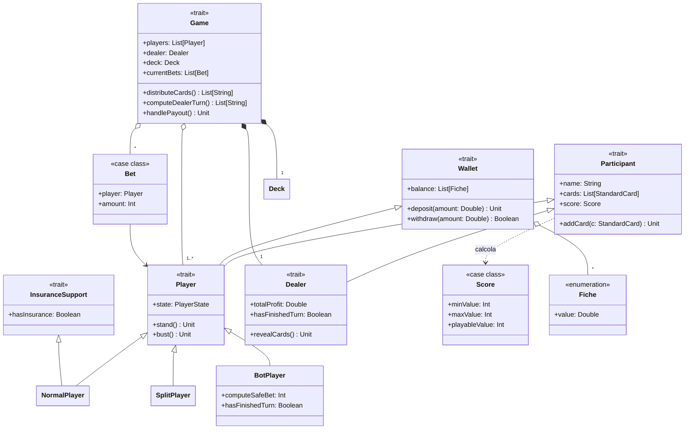

---

title: Model
nav_order: 1
parent: Design di dettaglio
grand_parent: Report

---

# Design del Model

Il *model* è organizzato in moduli, ciascuno dedicato a un concetto del dominio. Il seguente diagramma illustra le
entità principali e le loro relazioni.

## Participant, Player e Dealer

`Participant` è l'astrazione comune a chi partecipa a una mano: incapsula il nome, la mano di carte e il calcolo del
punteggio, oltre alle operazioni per aggiungere carte e per la rappresentazione testuale. Da esso derivano `Player` e
`Dealer`, che condividono la logica di gestione delle carte ma differiscono nel resto: il giocatore possiede un
portafoglio e uno stato, il banco un profitto e un comportamento automatico.

Il `Player` è progettato come **composizione di responsabilità** tramite *mixin*: estende `Participant` (gestione delle
carte) e `Wallet` (gestione del saldo). Le sue specializzazioni modellano i diversi tipi di giocatore:

- `NormalPlayer`: il giocatore umano; aggiunge il supporto all'assicurazione tramite il *trait* `InsuranceSupport`;
- `SplitPlayer`: la mano nata da uno *split*, inizializzata con una delle carte del giocatore originale;
- `BotPlayer`: il giocatore automatico, dotato di una strategia deterministica (si ferma a 17) e di puntata/saldo
  generati casualmente.

La separazione di `Wallet` e `InsuranceSupport` in *trait* distinti segue il principio di **segregazione delle
interfacce**: ogni aspetto (portafoglio, assicurazione) è un'astrazione a sé, aggiunta solo dove serve.

Il saldo gestito dal `Wallet` non è un semplice importo numerico, ma una collezione di `Fiche`, i gettoni a tagli
predefiniti con cui è rappresentato il denaro. La conversione fra importo e fiches è isolata nel modulo `Fiche`, da cui
il `Wallet` dipende solo attraverso l'interfaccia pubblica, senza conoscerne la rappresentazione interna
(**information hiding**).

*Contributi principali: modulo `Participant` e `Dealer` — Anna; classi `SplitPlayer` — Anna, `BotPlayer` — Nicholas;
stato e mano del giocatore — Elena; tipo `Fiche` e conversione valuta–fiches — Nicholas.*

## Game

`Game` è il *trait* centrale del *model*: rappresenta una partita e ne espone l'intera interfaccia (distribuzione delle
carte, turni, split, raddoppio, assicurazione, pagamenti, condizioni di terminazione). La sua implementazione concreta
`GameImpl` è **privata** all'interno del companion object `Game`, così che il resto del sistema dipende solo
dall'astrazione e mai dai dettagli (principio di *dependency inversion* e *information hiding*). Il companion object
funge inoltre da *factory* (metodi `apply`) e raccoglie le costanti e le funzioni di validazione statiche
(`isPlayerNumValid`, `isInitialDepositValid`, `arePlayersNamesValid`).

`Bet` è una semplice *case class* che associa un giocatore all'importo puntato nella mano corrente.

*Contributi principali: `Game`/`GameImpl` — sviluppo collaborativo, con pagamenti e fine mano curati da Nicholas ed
Elena.*

## Deck, Card e Score

Il mazzo (`Deck`) e le carte (`Card`) sono trattati in dettaglio nella pagina di
[implementazione del model](../impl/model.md), poiché ne sono rilevanti soprattutto gli aspetti realizzativi (*opaque
type* e `enum`). Sul piano progettuale, il `Deck` è concepito come una struttura immutabile da cui le operazioni di
pesca e mescolamento restituiscono un nuovo mazzo, e include una `CutCard` che ne segnala l'imminente esaurimento,
determinando la fine della partita.

Lo `Score` modella il punteggio di una mano come coppia di letture (minima e massima) per gestire la doppia valenza
dell'Asso; il calcolo vero e proprio è delegato a un motore **Prolog** (si veda
[Integrazione Scala–Prolog](../impl/prolog.md)).

*Contributi principali: `Card`/`Deck` — Anna; `CutCard` e terminazione partita — Elena; `Score` e regole di punteggio —
Nicholas.*
