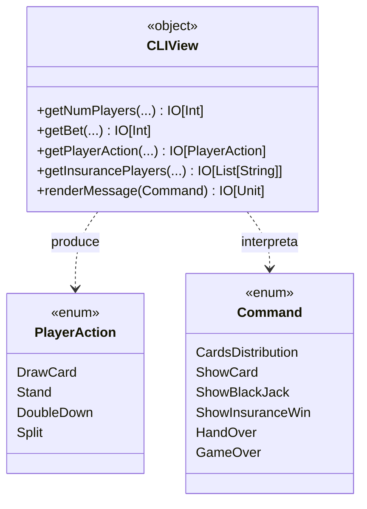

---

title: View
nav_order: 2
parent: Design di dettaglio
grand_parent: Report

---

# Design della View

La *view* è realizzata come un `object` (`CLIView`) privo di stato, il cui compito è esclusivamente l'**interazione con
l'utente** tramite la console. Non contiene logica di gioco e non modifica il *model*: espone funzioni che, dato un
insieme di predicati di validazione forniti dal *model*, leggono l'input o producono output, restituendo il risultato
incapsulato in un effetto `IO`.

## Comandi e azioni

Il dialogo tra *controller* e *view* è mediato da due `enum`:

- `PlayerAction` — le azioni che un giocatore può compiere nel proprio turno: `DrawCard`, `Stand`, `DoubleDown`,
  `Split`;
- `Command` — gli eventi di gioco da comunicare all'utente: distribuzione delle carte, Blackjack, turno del banco,
  sballamento, vincita da assicurazione, saldi, fine mano, fine partita, ecc.

## Input validato e robusto

Tutte le funzioni di acquisizione input condividono lo stesso schema: mostrano un messaggio, leggono una riga, provano a
**interpretarla** (*parsing*), ne **validano** il risultato con un predicato e, in caso di errore, mostrano un messaggio
e **ripropongono** l'inserimento. Questo schema è fattorizzato in un'unica funzione generica di ordine superiore
(`promptUntilValid`), soddisfacendo il principio **DRY** ed evitando la duplicazione tra i molti punti di input. I
dettagli realizzativi sono descritti nell'[implementazione della view](../impl/view.md).

Una scelta progettuale rilevante è la **duplicazione consapevole della validazione**: la *view* valida l'input per
garantire una buona esperienza d'uso, ma il *model* valida comunque in modo indipendente per proteggere i propri
invarianti. I due controlli hanno responsabilità distinte e coesistono legittimamente.

*Contributi principali: funzioni di gestione user input e rendering — Elena.*

