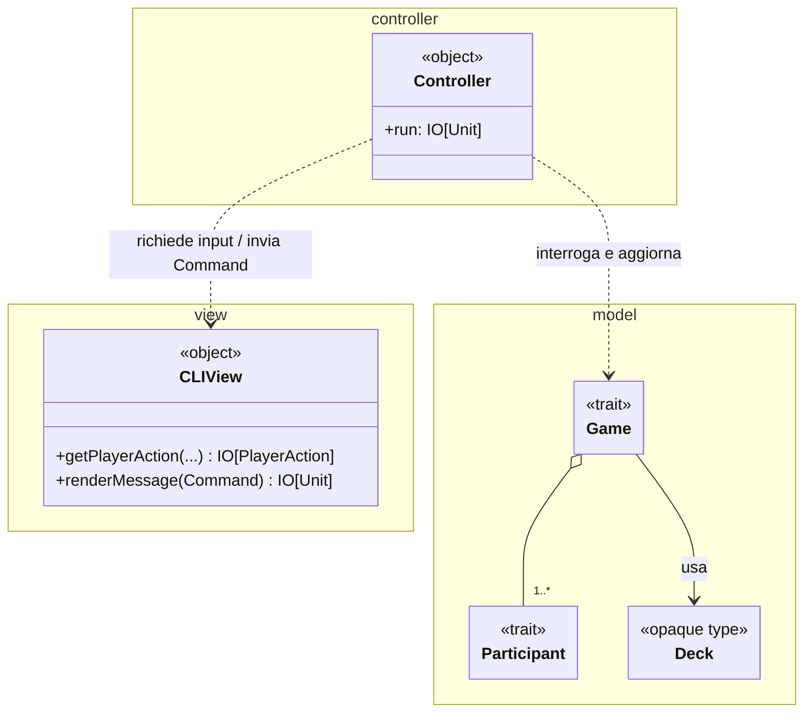
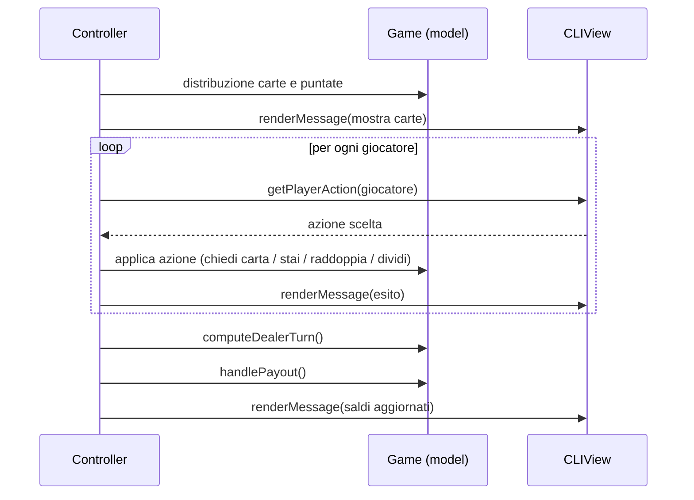

---

title: Design architetturale
nav_order: 3
parent: Report

---

# Design architetturale

Come pattern architetturale è stato adottato il **Model-View-Controller (MVC)**. Trattandosi di un gioco a turni e non
in tempo reale, MVC consente una chiara separazione delle responsabilità: il *model* incapsula lo stato e le regole del
gioco, la *view* si occupa esclusivamente dell'interazione con l'utente da terminale, e il *controller* orchestra il
flusso di gioco mettendo in comunicazione i due.

A differenza di una realizzazione MVC "a notifica" (in cui la view osserva il model), in ScalaJack il flusso è
**guidato dal controller**: il *model* è passivo, la *view* è un insieme di funzioni pure di input/output, e il
*controller* è l'unico componente che dipende da entrambi, sequenziandone le operazioni all'interno della monade `IO`
di **Cats Effect**.

## Model

Il *model* contiene lo stato e la logica del gioco ed è organizzato in **moduli**, ciascuno realizzato come un `object`
che raccoglie i tipi e le operazioni di un concetto del dominio (per esempio `GameModule`, `DeckModule`,
`PlayerModule`). L'entità centrale è il *trait* `Game`, che rappresenta una partita e ne espone le operazioni:
distribuzione delle carte, gestione dei turni, calcolo delle vincite, condizioni di terminazione. I partecipanti
(`Participant`) si specializzano in `Player` (e nelle sue varianti `NormalPlayer`, `SplitPlayer`, `BotPlayer`) e
`Dealer`. Il *model* non conosce né la view né il controller ed è pienamente verificabile in isolamento tramite test.

## View

La *view* (`object CLIView`) è responsabile **unicamente** dell'interazione con l'utente attraverso la console. Espone due
famiglie di funzioni:

- funzioni di **acquisizione input** (per esempio `getNumPlayers`, `getBet`, `getPlayerAction`), che leggono, validano e
  ripropongono l'inserimento in caso di errore, restituendo il risultato incapsulato in un `IO`;
- una funzione di **rendering** (`renderMessage`), che traduce in output testuale i messaggi di gioco.

L'interazione è definita da due enumerazioni: `PlayerAction` (le azioni possibili in un turno) e
`Command` (gli eventi da mostrare all'utente). La view non contiene alcuna logica di gioco e non modifica il model:
riceve valori e restituisce effetti `IO`, risultando così testabile e sostituibile.

## Controller

Il *controller* (`object Controller extends IOApp.Simple`) è il punto di ingresso dell'applicazione e ne governa il
ciclo di vita. Il suo compito è **orchestrare** il flusso: inizializza la partita, itera le mani finché la partita non
termina e gestisce la conclusione. All'interno di ogni mano coordina le fasi (inizializzazione, turni dei giocatori,
turno del banco, pagamenti, chiusura) invocando le operazioni del *model* e inviando alla *view* i `Command` da
mostrare, il tutto componendo effetti `IO`. È l'unico componente che dipende sia dal *model* sia dalla *view*.

Il flusso complessivo di una mano, orchestrato dal controller, è illustrato nel seguente diagramma.

