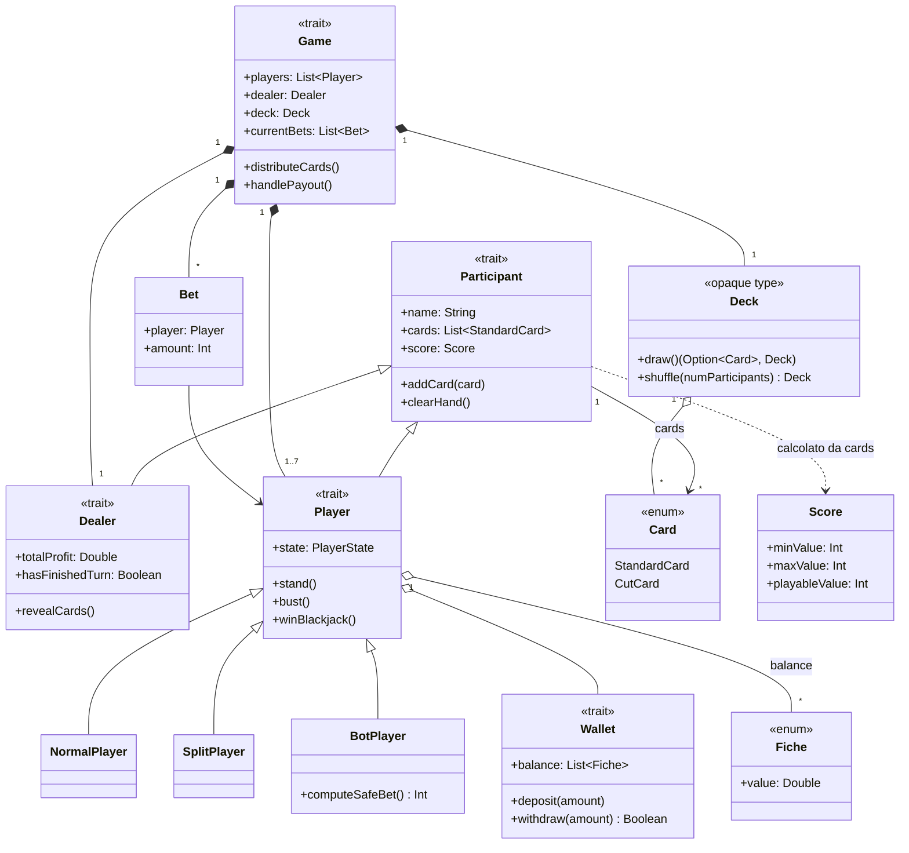

# Domain model

## Concetti principali

- **Participant** — astrazione base per chiunque abbia una mano di carte e un punteggio: banco e giocatori.
- **Dealer** — il banco: rivela le proprie carte, gioca automaticamente secondo la soglia di 17 e accumula un profitto.
- **Player** — un giocatore con un portafoglio (`Wallet`) di fiches e uno stato di gioco (`PlayerState`).
  Si specializza in `NormalPlayer` (umano, supporta l'assicurazione), `SplitPlayer` (nato da uno split) e
  `BotPlayer` (giocatore automatico).
- **Card** — una carta standard (seme, valore, orientamento) oppure la carta di taglio (`CutCard`), usata
  per segnalare la fine imminente del mazzo.
- **Deck** — la sequenza di carte in gioco, con operazioni di pesca e mescolamento.
- **Fiche** — le fiches con cui i giocatori puntano, in tagli fissi (0.5, 2, 5, 10, 20, 50).
- **Score** — il punteggio di una mano, espresso con doppia lettura (valore minimo/massimo) per gestire l'ambiguità dell'Asso.
- **Bet** — l'associazione tra un giocatore e l'importo puntato in una mano.
- **Game** — l'aggregato che coordina giocatori, banco, mazzo, puntate e le regole di svolgimento di una mano.

## Diagramma delle classi

## Note di modellazione

- `Deck` è modellato come **opaque type** su `List[Card]`, per esporre solo le operazioni di dominio
  (`draw`, `shuffle`, `isEmpty`, `size`) senza rivelare la rappresentazione interna.
- Il calcolo dello `Score` è **derivato** dalle carte del `Participant` (non è uno stato mutabile),
  ed è delegato a un motore Prolog (si veda il [Design di dettaglio](./design-di-dettaglio/)).
- `SplitPlayer` e `BotPlayer` non sono varianti alternative arbitrarie di `Player`, ma rappresentano
  casistiche di gioco reali: la mano generata da uno split e il giocatore automatico, rispettivamente.
