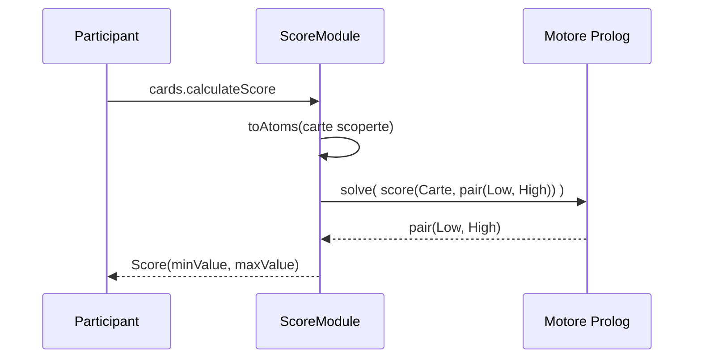

---

title: Integrazione Scala-Prolog
nav_order: 2
parent: Implementazione
grand_parent: Report

---

# Integrazione Scala–Prolog

Una delle scelte più caratterizzanti del progetto è la **delega del calcolo del punteggio a un motore Prolog**,
integrato tramite la libreria **tuProlog**. La regola del punteggio nel Blackjack — in cui l'Asso vale 1 oppure 11 e si
può "alzare" al più un Asso da 1 a 11 — si esprime in modo naturale e conciso con la programmazione logica, mostrando
l'interoperabilità tra il paradigma a oggetti/funzionale di Scala e quello logico.

## Il ponte Scala–Prolog

L'oggetto `Scala2P` costruisce il motore Prolog a partire da una teoria e lo espone come una **funzione** che, dato un
*goal*, restituisce la `LazyList` delle sue soluzioni. Due `given Conversion` permettono di convertire in modo
trasparente stringhe e sequenze Scala in termini Prolog:

```scala
object Scala2P:
  given Conversion[String, Term] = Term.createTerm(_)
  given Conversion[Seq[_], Term] = _.mkString("[", ", ", "]")

  def mkPrologEngine(clauses: String*): Term => LazyList[Term] =
    val engine = Prolog()
    engine.setTheory(Theory(clauses mkString " "))
    goal => // iterazione pigra sulle soluzioni del goal
      ...
```

Rispetto alla versione vista a lezione, l'iterazione sulle soluzioni è stata adattata per gestire correttamente l'uso
del **cut** (`!`) nella teoria: la soluzione successiva viene richiesta solo se esistono alternative ancora aperte
(`hasOpenAlternatives`), evitando così che un *goal* già "cuttato" sollevi un'eccezione al tentativo di produrre una
seconda soluzione inesistente. In questo modo la valutazione di un goal termina in modo pulito.

## La teoria del punteggio

La teoria Prolog associa a ogni carta il suo valore, calcola la somma "bassa" (Assi contati come 1) e, se è presente un
Asso, ne "alza" esattamente uno di 10 per ottenere la somma "alta". Il predicato `blackjack/1` riconosce il 21 con due
sole carte:

```prolog
value(two, 2).   value(three, 3). ... value(king, 10).

low_value(ace, 1) :- !.
low_value(C, V) :- value(C, V).

low_sum([], 0).
low_sum([C|Cs], S) :- low_value(C, V), low_sum(Cs, S1), S is V + S1.

has_ace(Cards) :- member(ace, Cards).

% se c'è un asso, ne alzo esattamente uno da 1 a 11; altrimenti Low = High
raised(Cards, Low, High) :- has_ace(Cards), !, High is Low + 10.
raised(_, Low, Low).

score(Cards, pair(Low, High)) :-
  low_sum(Cards, Low),
  raised(Cards, Low, High).

blackjack([C1, C2]) :- score([C1, C2], pair(_, 21)).
```

## Utilizzo dal lato Scala

Dal lato Scala, la funzione `calculateScore` (un *extension method* su `List[StandardCard]`) trasforma le carte scoperte
in atomi Prolog, interroga il motore con il goal `score/2` ed estrae i due valori della coppia, incapsulandoli nel tipo
`Score`:

```scala
extension (cards: List[StandardCard])
  def calculateScore: Score =
    if cards.isEmpty then Score(0, 0)
    else
      val pair = engine(Struct("score", toAtoms(cards.filter(_.isFaceUp)), Var())).map(extractTerm(_, 1)).head
      Score(extractTerm(pair, 0).toString.toInt, extractTerm(pair, 1).toString.toInt)
```

Il seguente diagramma di sequenza riassume il calcolo del punteggio di una mano.



Il tipo `Score` interpreta poi la coppia: `playableValue` restituisce la lettura alta se non fa sballare, altrimenti
quella bassa, mentre `toString` mostra entrambe le letture quando differiscono e non superano 21.

*Contributi principali: modulo `Score`, teoria Prolog e integrazione — Nicholas.*
