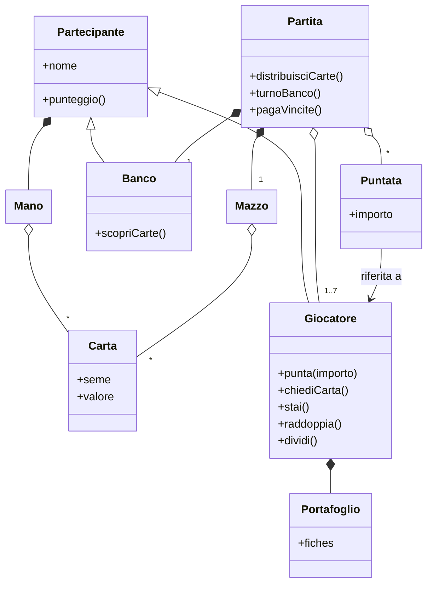
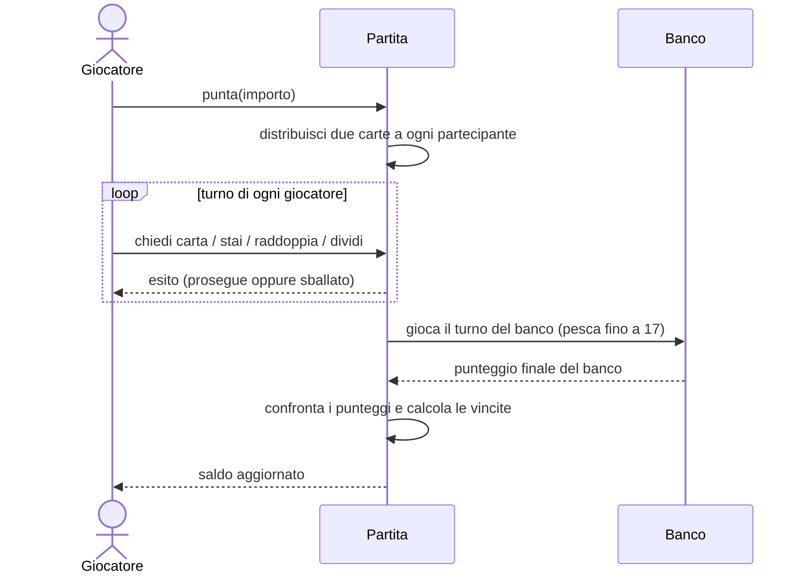

---

title: Requirement specification
nav_order: 2
parent: Report

---

# Requirement Specification

## Descrizione del progetto

**ScalaJack** è un'implementazione in Scala del gioco da casinò **Blackjack**, giocabile da riga di comando. Il gioco
prevede un numero variabile di giocatori umani (fino a un massimo di sette) che si trovano allo stesso tavolo: ognuno di essi
sfida individualmente il **banco**.

Una partita è costituita da diverse **mani**, che utilizzano tutte le carte di uno stesso mazzo; la partita termina
quando le carte del mazzo si esauriscono. In ciascuna mano il banco distribuisce inizialmente due carte scoperte a ogni
giocatore, mentre a sé stesso ne distribuisce una coperta e una scoperta. Successivamente ogni giocatore ha diritto al
proprio turno, durante il quale può richiedere altre carte: se il totale del valore delle sue carte supera 21 il
giocatore perde automaticamente la mano, perché ha **sballato**.

Al termine dei turni di tutti i giocatori il banco scopre la propria carta coperta e ha l'obbligo di continuare a
distribuirsi carte finché la somma non è maggiore o uguale a 17, per poi fermarsi. Se il banco supera 21, tutti i
giocatori che non hanno sballato vincono automaticamente. Un giocatore vince la mano quando la somma del valore delle
sue carte è superiore a quella del banco ma minore o uguale a 21; più giocatori possono quindi vincere la stessa mano.

Prima di ogni mano ogni giocatore sceglie quanto **puntare**, avendo a disposizione un numero iniziale di **fiches**
fissato all'avvio della partita. In caso di vittoria il giocatore riceve il doppio della propria puntata; in caso di
**Blackjack** (21 con sole due carte, ad esempio Asso e una figura) riceve 2,5 volte la puntata; in caso di sconfitta
perde le fiches puntate; in caso di pareggio col banco (*push*) riprende la puntata.

## Requisiti di business

I principali obiettivi posti dalla realizzazione del progetto sono:

- consolidare le competenze acquisite durante il corso, utilizzando tecniche avanzate di Scala (per esempio *enum* e
  tipi algebrici, *opaque type*, *mixin*, *extension method*, *context abstractions* e monadi);
- sfruttare il **Test-Driven Development** (TDD);
- sperimentare la gestione di un processo di sviluppo **Agile/Scrum**, con backlog, sprint e release incrementali;
- integrare più paradigmi, affiancando alla programmazione funzionale e a oggetti di Scala una componente di
  **programmazione logica** in Prolog;
- completare il progetto in maniera conforme alle specifiche d'esame.

I requisiti di business si riterranno soddisfatti se:

- saranno inseriti elementi avanzati di Scala nel progetto;
- ogni funzionalità risulterà verificabile tramite i test realizzati seguendo il TDD;
- il lavoro sul repository sarà suddiviso tra i branch `master` (versioni stabili) e `develop` (sviluppo);
- la consegna del progetto avverrà entro la scadenza prefissata.

## Modello di dominio

Gli elementi principali che compongono il dominio del gioco sono:

- **Partita**: gestisce lo svolgimento del gioco, tenendo traccia dei giocatori al tavolo, del banco, del mazzo e delle
  puntate correnti; scandisce le mani fino all'esaurimento del mazzo.
- **Partecipante**: astrazione comune a giocatore e banco, caratterizzata da un nome, dalla mano di carte posseduta e
  dal relativo punteggio.
- **Giocatore**: partecipante dotato di un portafoglio di fiches, che ad ogni mano effettua una puntata e nel proprio
  turno può chiedere carte, fermarsi, raddoppiare o dividere la mano.
- **Banco**: partecipante che gioca automaticamente seguendo un algoritmo deterministico (si ferma a 17) e accumula il proprio
  profitto.
- **Mazzo**: insieme delle carte da cui si pesca; contiene una carta speciale - *cut card* - che segnala l'imminente esaurimento delle carte e quindi la possibilità di concludere la mano in corso.
- **Carta**: caratterizzata da un seme e un valore; può essere scoperta o coperta.
- **Mano**: insieme delle carte possedute da un partecipante.
- **Punteggio**: valore della mano; l'Asso vale 1 oppure 11, per cui una mano può avere una doppia lettura.
- **Puntata**: importo scommesso da un giocatore in una mano.
- **Fiche**: gettone di gioco con un taglio predefinito; un insieme di fiches compongono il portafoglio di un giocatore.

Si modella tramite un diagramma di sequenza lo svolgimento complessivo di una mano, dalla puntata iniziale fino al
pagamento delle vincite.

## Requisiti funzionali

### Requisiti utente

1. Il giocatore deve poter avviare una partita indicando il numero di giocatori umani; in una partita devo essere presenti 7 giocatori, per cui i posti liberi vengono riempiti da *bot*.
2. Ogni giocatore deve poter depositare un saldo iniziale, convertito automaticamente in fiches.
3. Prima di ogni mano ogni giocatore deve poter scegliere la propria puntata, entro i limiti del proprio saldo.
4. Nel proprio turno il giocatore deve poter **chiedere carta/e** o **fermarsi**; quando le condizioni lo consentono
   deve poter anche **raddoppiare** o **dividere** (*split*) la mano.
5. Quando la carta scoperta del banco è un Asso, il giocatore deve poter acquistare l'**assicurazione**.
6. Il giocatore deve poter visualizzare in ogni momento le proprie carte, il proprio punteggio e il proprio saldo.
7. Al termine di una mano il giocatore deve poter lasciare volontariamente la partita, riottenendo il saldo residuo convertito in valuta.

I suddetti requisiti utente vengono validati tramite *User Acceptance Test* (esecuzione interattiva dell'applicazione).

### Requisiti di sistema

1. Il sistema deve gestire l'avvio della partita assegnando a ogni giocatore il saldo iniziale in fiches e generando un mazzo dimensionato sul numero di partecipanti, comprensivo di *cut card*.
2. Il sistema deve gestire ciclicamente le mani e, all'interno di ognuna, i turni dei giocatori e del banco.
3. Il sistema deve gestire le azioni disponibili per il giocatore durante il proprio turno, verificandone le condizioni di eseguibilità e applicandone correttamente gli effetti sullo svolgimento della mano. In particolare:
  - **Chiedere carta (DrawCard):** il giocatore può richiedere **una sola carta per volta**. Dopo ogni carta ricevuta, il sistema aggiorna il valore della mano e, se il giocatore non ha sballato, gli consente di scegliere nuovamente se richiedere un'altra carta o fermarsi. L'azione può essere ripetuta in modo sequenziale finché il valore della mano è **inferiore o uguale a 21** e il giocatore **non decide di fermarsi**.
  - **Fermarsi (Stand):** il giocatore può terminare volontariamente il proprio turno **in qualsiasi momento prima di aver sballato**, mantenendo invariato il punteggio della mano.
  - **Raddoppiare (Double Down):** il giocatore può raddoppiare la puntata **esclusivamente come prima azione sulla mano iniziale** (dopo la distribuzione delle prime due carte), e solo se il suo balance attuale lo permette. Il sistema deve **raddoppiare la puntata**, distribuire **esattamente una carta aggiuntiva** e **terminare immediatamente il turno** del giocatore.
  - **Dividere la mano (Split):** il giocatore può effettuare lo split **esclusivamente quando le prime due carte della mano hanno lo stesso valore**. Il sistema deve **suddividere la mano in due mani distinte** aventi entrambe come puntata la puntata iniziale - che viene perciò raddoppiata e suddivisa tra le due mani - e assegnando una delle due carte a ciascuna mano, distribuendo **una nuova carta a entrambe** e **inserendo un nuovo turno del giocatore**, relativo alla seconda mano, **immediatamente dopo il completamento del turno della prima**, mantenendo l'ordine di gioco degli altri partecipanti.
4. Il sistema deve calcolare correttamente il punteggio di una mano, gestendo la doppia valenza dell'Asso (1 o 11) e il riconoscimento del Blackjack.
5. Il sistema deve determinare le vincite confrontando ogni giocatore con il banco, applicando le regole di pagamento (2× la puntata in caso di vittoria, 2,5× in caso di Blackjack, restituzione in caso di pareggio).
6. Il sistema deve rilevare la fine della partita al raggiungimento della *cut card* e liquidare i giocatori rimasti.
7. Il sistema deve gestire i giocatori automatici (*bot*), che giocano secondo una strategia deterministica.

I suddetti requisiti di sistema vengono validati tramite test automatizzati.

## Requisiti non funzionali

1. **Usabilità**: l'interfaccia a riga di comando deve essere chiara e non ambigua, guidando il giocatore con messaggi e
   la validazione degli input.
2. **Portabilità**: l'applicazione deve poter essere eseguita su qualsiasi piattaforma dotata di JVM.
3. **Robustezza**: gli input non validi non devono interrompere l'esecuzione, ma essere gestiti richiedendo un nuovo inserimento.

## Requisiti di implementazione

1. Utilizzo di **Scala 3** come linguaggio di programmazione principale.
2. Utilizzo di una componente in **Prolog** (tramite tuProlog) per il calcolo del punteggio.
3. Utilizzo di **Git** come sistema di versionamento.
4. Presenza della documentazione (**Scaladoc**) per ogni API pubblica.
